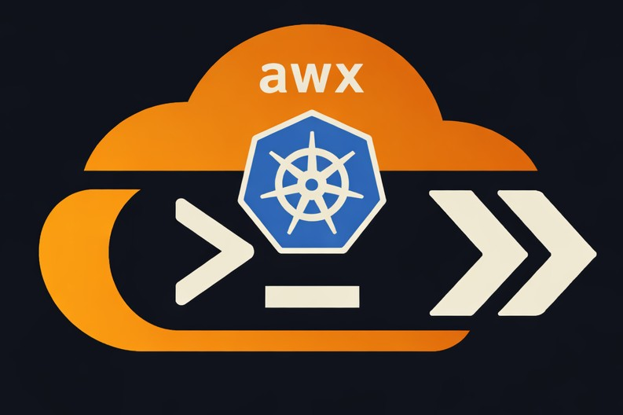

<div align="center">
  

# awx


[](https://opensource.org/licenses/MIT)

_Fast AWS Profile & EKS Context Switching for DevOps and Cloud Engineers_
</div>

## Overview

`awx` is a minimal Bash CLI to streamline AWS profile switching and EKS kubeconfig management for multi-account AWS setups. It supports both SSO-based and static credential profiles transparently.

## Features

- Fuzzy, interactive AWS profile selection via [`fzf`](https://github.com/junegunn/fzf)
- Non-interactive mode: `awx use --profile X --cluster Y` for scripts and automation
- Profile shortcut: `awx profile-name` as an alias for `awx use --profile profile-name`
- **`awx -`** — Toggle back to the previous AWS profile and EKS cluster (like `cd -` / `git checkout -`)
- Zsh tab completion for commands, subcommands, and AWS profile names
- **Supports both SSO and static credential profiles** — detects credential type per profile automatically
- SSO login automation with graceful fallback to static credentials when SSO fails
- Automatically updates current [`kubeconfig`](https://kubernetes.io/docs/concepts/configuration/organize-cluster-access-kubeconfig/)
- Shows your current AWS identity as confirmation
- Friendly and clear error output with robust logging

## Usage
`awx` is a versatile script for managing AWS profiles and EKS kubeconfig contexts. Below are the primary commands and their purposes:

```sh
# Interactive mode (prompts with fuzzy finder)
awx                                          # Select AWS profile and cluster
awx use                                      # Same as awx
awx profile-name                             # Shortcut: set profile, then select cluster

# Non-interactive mode (for scripts and automation)
awx use --profile my-profile                 # Set profile without prompts
awx use --profile my-profile --cluster myc   # Fully non-interactive
awx --profile my-profile                     # Top-level flag (equivalent to above)

# Other commands
awx whoami                                   # Show current AWS identity
awx eks list                                 # List available EKS clusters for active profile
awx eks update                               # Update kubeconfig for a specific cluster
awx help or -h                               # Show detailed usage instructions
awx logout                                   # Logout of the current AWS SSO session
```

### Toggle to previous environment

Switch back to the last used profile/cluster:

```bash
awx -
```

Running `awx -` again toggles back to the original environment. State is persisted across shell sessions in `~/.local/state/awx/env`.

### Example Workflow
```sh
$ awx
[INFO] Using profile: client-A (region: eu-central-1)
[INFO] Updating kubeconfig for cluster: cluster1-client-A
[INFO] Kubeconfig updated successfully
```

## Installation

### 1. Install Dependencies
- [AWS CLI](https://aws.amazon.com/cli/)
- [fzf](https://github.com/junegunn/fzf)
- [jq](https://jqlang.org/)

### 2. Clone and Set Up
```sh
git clone https://github.com/chris.schindlbeck/awx.git
cd awx
chmod +x awx

# Option 1: Source awx script
# Add one of the following lines to your ~/.zshrc file:
# Using full path: source /path/to/awx
# or using relative path (if in repo): source $(pwd)/awx

# Option 2: Use with oh-my-zsh (or similar setup)
ln -s $(pwd)/awx ~/.oh-my-zsh/custom/awx.zsh

# Option 3: Source awx via .zshrc
# Add the following line to your ~/.zshrc file:
source $(pwd)/awx
```

### 3. Shell Completion (Zsh)

Tab-completes commands, subcommands, and AWS profile names.

**Plain zsh** (add to `~/.zshrc`):
```zsh
fpath=(/path/to/awx/completions $fpath)
autoload -Uz compinit && compinit
```

**Oh My Zsh:**
```zsh
mkdir -p ~/.oh-my-zsh/completions
cp completions/_awx ~/.oh-my-zsh/completions/
# Restart your shell or run: exec zsh
```

## Testing and Quality

This project uses automated tests and pre-commit hooks that run in CI to ensure code quality and correct behavior.
**All contributors should run both locally before pushing or submitting a pull request.**

### 1. Automated Tests (bats)
- The main suite is written in `bats-core`. To use:

  **On macOS:**
  ```bash
  brew install bats-core
  ```

  **On Linux/other platforms (manual install):**
  ```bash
  curl -fsSL https://github.com/bats-core/bats-core/archive/refs/heads/master.zip -o bats.zip
  unzip bats.zip && cd bats-core-master && ./install.sh ~/bats-local && cd ..
  rm -rf bats.zip bats-core-master
  export PATH=$HOME/bats-local/bin:$PATH
  ```

- To run all tests:
  ```bash
  bats tests
  ```
- Run an individual test file:
  ```bash
  bats tests/whoami.bats
  ```

Sample bats output:
```text
1..4
ok 1 awx whoami with valid AWS_PROFILE
not ok 2 awx whoami with missing AWS_PROFILE
...
```

### 2. Pre-commit Hooks
Automated quality checks, formatting, and linting are enforced by [pre-commit](https://pre-commit.com/).

- To manually check pre-commit hooks:
  ```sh
  pre-commit run --all-files
  ```
- These hooks run automatically on commit/pull request via GitHub Actions. **You must pass these checks for your contributions to be accepted.**

**Best practice: Always run both the test suite and pre-commit before committing or opening a PR.**

## Tips & Behavior
- If required tools (`aws`, `fzf`, or `jq`) are missing, `awx` will tell you exactly what to install.
- `kubeconfig` is updated *per profile*; back up your old file if you need persistent custom setups.
- **Credential detection is automatic**: `awx` checks for `sso_start_url` to detect SSO profiles and `aws_access_key_id` for static credentials. No manual configuration required.
- If a profile has both SSO and static credentials configured, SSO is attempted first. On SSO failure, `awx` falls back to static credentials automatically.
- Defaults to region from `AWS_REGION`, falling back to `eu-central-1` if unset.

## Contributing
Contributions, issues, and PRs are welcome!

To develop locally:
1. Fork & clone.
2. Install dependencies (see above).
3. Make changes on a new branch.
4. Run all tests and hooks as described above before opening a PR:
```sh
bats tests/
pre-commit run --all-files
```
